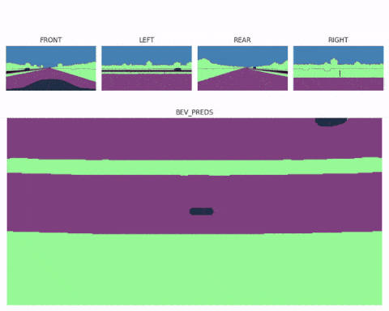

Explore some of the projects I’ve worked on. Click any project for more details.

## [4D Perception](https://github.com/Rouizi/4d-perception)

In this project, I learned how to do 3D object detection, tracking, and visualization using LiDAR and camera data.

## [Stereo Depth Estimation](https://github.com/Rouizi/stereo-depth-estimation)

This project explores **stereo vision** techniques for depth estimation.
It covers camera calibration, disparity map generation, depth map computation, and obstacle detection in 3D from stereo images.

## [Visual Fusion](https://github.com/Rouizi/visual-fusion)

Early and late fusion techniques to combine LiDAR point clouds and camera images for obstacle detection.

## [Bird’s Eye View Perception](https://github.com/Rouizi/bird-eye-view)

This repository contains my work on **Bird’s Eye View (BEV) transformation** using both classical and deep learning methods. 
